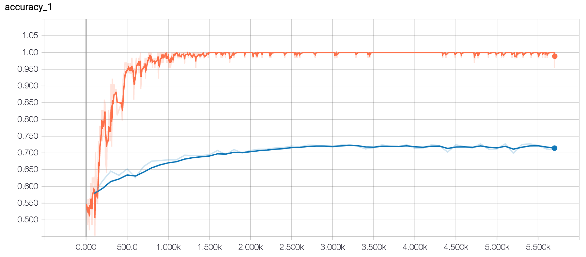

# CNN for Rotten Tomatoes Movie Reviews

> This model aims to classify movie reviews from Rotten Tomatoes as either positive or negative.

## Dataset Description

The dataset used are sentences from Pang and Lee's [movie review dataset](http://www.cs.cornell.edu/people/pabo/movie-review-data/) — `sentence polarity dataset v1.0`. There are 5,331 positive and 5,331 negative sentences, formed from a vocabulary size of ~20,000.

### Preprocessing

> The data preprocessing code is available in `data.py` and is identical to the code used in [Kim's paper](https://arxiv.org/pdf/1408.5882.pdf).

1. Load the data from the files inside `data/`.
2. `.strip()` every sentence.
3. Replace any characters that don't match ``[A-Za-z0-9(),!?\'\`]``.
4. Insert a whitespace between a word and `'ve`, `'re` etc.
5. Insert a whitespace before punctuation marks.
6. Delete repeated whitespaces.

# Model v1

> Code based on Denny Britz's TensorFlow adaptation of Kim's model, which is blogged about [here](http://www.wildml.com/2015/12/implementing-a-cnn-for-text-classification-in-tensorflow/).

## Data Preparation

The sentences from the dataset are fed into TensorFlow's `VocabularyProcessor` that builds a vocabulary index and maps each word to an integer between 0 and 18,757 (vocabulary size). Each sentence is padded with special padding tokens `<UNK>` (index of 0 in vocabulary) to fit the maximum sentence size of 56 words.

The data is shuffled and 10% of the dataset is used as the test set.

## Model Description

> The code for the model can be found in `v1_model.py`.

The model consists of an embedding layer followed by multiple convolutional + max-pool layers before the output is classified using a softmax layer.

### Hyperparameters

- `embedding_size`: The dimensionality of the embeddings (lower-dimensional vector representations of the vocabulary indices).
- `filter_sizes`: The number of words the convolutional filters should cover. For example, `[3, 4, 5]` will create filters that slide over 3, 4 and 5 words respectively.
- `num_filters`: The number of filters per filter size.
- `l2_reg_lambda`: L2 regularization term. Default is 0.
- `dropout_keep_prob`: Probability of keeping a neuron in the dropout layer.

## Accuracy of Model

> The code for training can be found in `v1_train.py`.

Below are the different training runs of this model with different hyperparameter values to explore their effect on the accuracy of the trained model. In most of the runs, the training was stopped before the full 200 epochs (but once convergence was somewhat achieved) due to time constraints. The full list of runs can be found in `v1_runs.txt`.

### Initial Run

Embedding Dimensionality: 128, Filter Sizes: 3, 4, 5, Number of Filters: 128, Dropout Keep Probability: 0.5, L2: 0.0

Maximum Test Accuracy: 75.80%

Since test accuracy is significantly below training accuracy, it suggests that the model is overfitting the training data. This could be because the dataset is too small, regularization is too weak or there are too many model parameters.

### Dropout

Embedding Dimensionality: 128, Filter Sizes: 3, 4, 5, Number of Filters: 128, L2: 0.0

#### Dropout Keep Probability: 0.3

Maximum Test Accuracy: 73.08%.

Surprisingly, a decreased dropout keep probability (i.e. increased dropout rate) leads to a slightly less accurate model. Perhaps the dropout rate was increased by too much?

#### Dropout Keep Probability: 0.4

Maximum Test Accuracy: 74.11%.

Slight increase in accuracy as the dropout rate is decreased, which suggests that a dropout keep probability of 0.3 was resulting in under-learning by the network. However, this model is still less accurate than the one trained with a dropout rate of 0.5.

#### Dropout Keep Probability: 0.1

Maximum Test Accuracy: 74.67%

I tried an extremely high dropout rate to validate my under-learning concern. It seems like dropout keep probabilities below 0.5 do tend to affect the ability of the network to learn properly.

#### Dropout Keep Probability: 0.6

Maximum Test Accuracy: 74.77%

I tried decreasing the dropout rate from 0.5 to check if that value was also causing the network to under-learn but it actually results in a slightly lower accuracy, suggesting overfitting of the training data.

#### Dropout Keep Probability: 0.9

Maximum Test Accuracy: 72.70%

An extremely low dropout rate seems to overfit the training data too.

# References

- [Convolutional Neural Networks for Sentence Classification](https://arxiv.org/abs/1408.5882)
- https://github.com/yoonkim/CNN_sentence
- [Implementing a CNN for Text Classification - Denny Britz](http://www.wildml.com/2015/12/implementing-a-cnn-for-text-classification-in-tensorflow/)
- https://github.com/dennybritz/cnn-text-classification-tf

